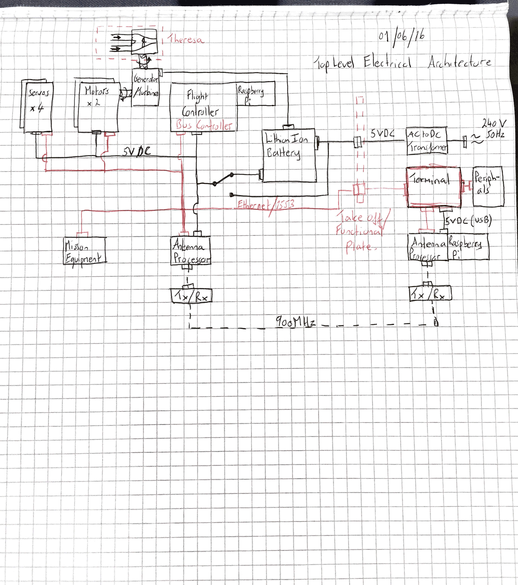
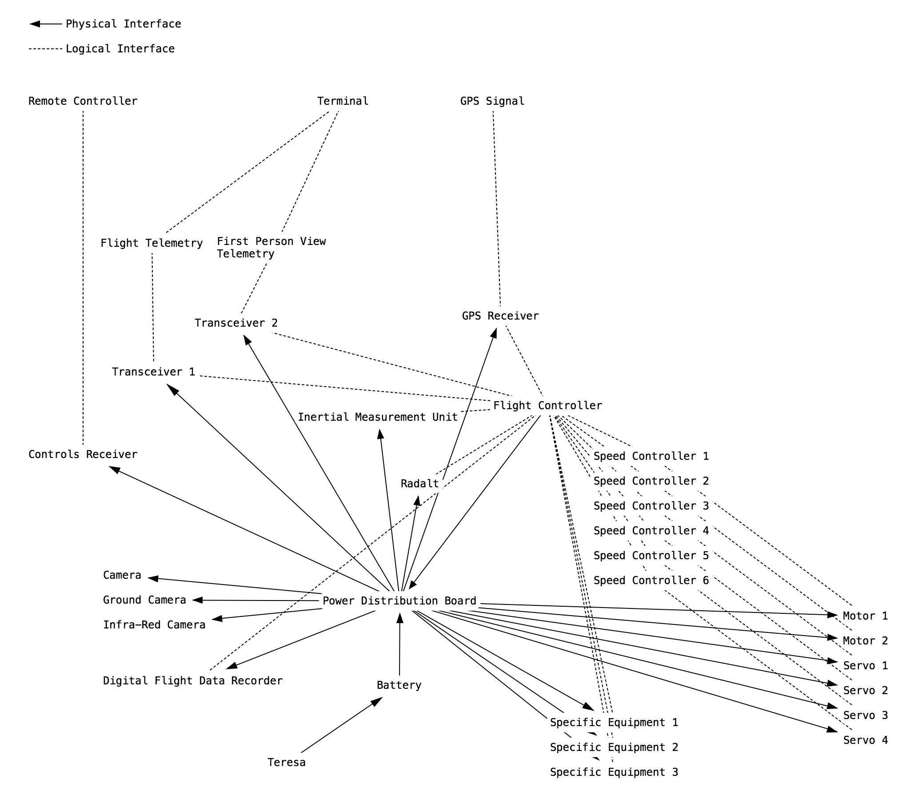

# Assessment Schematics

MEC Electrical Architecture 2016 03 12

MEC Electrical Architecture - 2016 06 02

MEC Electrical Architecture - 2016 06 05

# Reviews and Comments
2016 06 02
Electrical architecture sketch placed in Architecture. I'll do this on a drawing app soon. Any comments?

2016 06 05
Cool. Have uploaded the Sketch I showed you and have attached the current Draft of its IT version. I did not understand why you had a double Tx/Rx but it might be a question of granularity of the representation. Let us discuss/amend at the next session!
Nevertheless, thinking of changing S/W for something dedicated to UML/SYSML and co.

# Assessment Drawings
The following Drawing formalises the Assessment Phase Electrical Architecture.
It also captures the Work Breakdown Structure (WBS) anticipated, thus identifying block relevant to Phase 2 in line with the Programme Management Plan.

