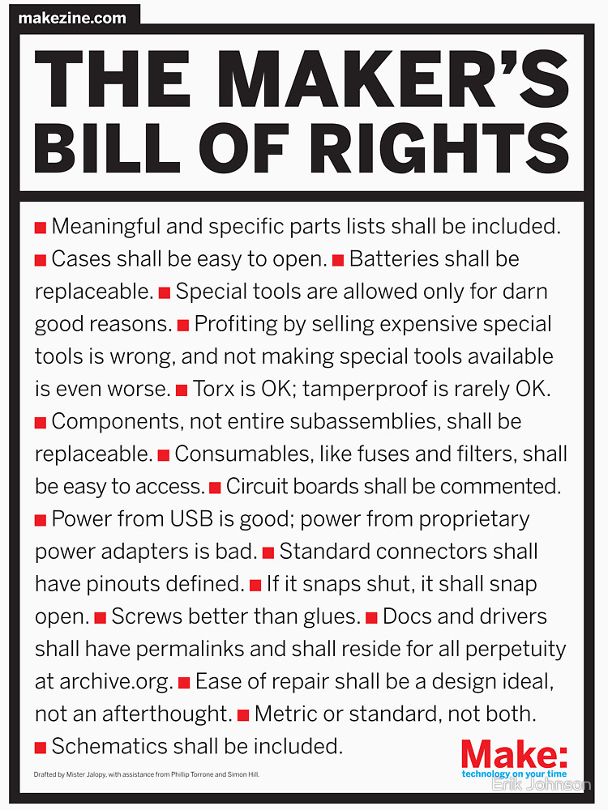

The Maker's Bill of Rights (drafted by Mister Jalopy, with assistance from Phillip Torrone and Simon Hill).

- Meaningful and specific parts lists shall be included.
- Cases shall be easy to open.   Batteries shall be replaceable.
- Special tools are allowed only for darn good reasons.
- Profiting by selling expensive special tools is wrong, and not making special tools available is even worse.
- Torx is OK; tamperproof is rarely OK.
- Components, not entire subassemblies, shall be replaceable.
- Consumables, like fuses and filters, shall be easy to access.  
- Circuit boards shall be commented.
- Power from USB is good; power from proprietary power adapters is bad.
- Standard connectors shall have pinouts defined.
- If it snaps shut, it shall snap open.
- Screws better than glues.
- Docs and drivers shall have permalinks and shall reside for all perpetuity at archive.org.
- Ease of repair shall be a design ideal, not an afterthought.   Metric or standard, not both.
- Schematics shall be included.

[Via](http://cdn.makezine.com/make/MAKERS_RIGHTS.pdf)
