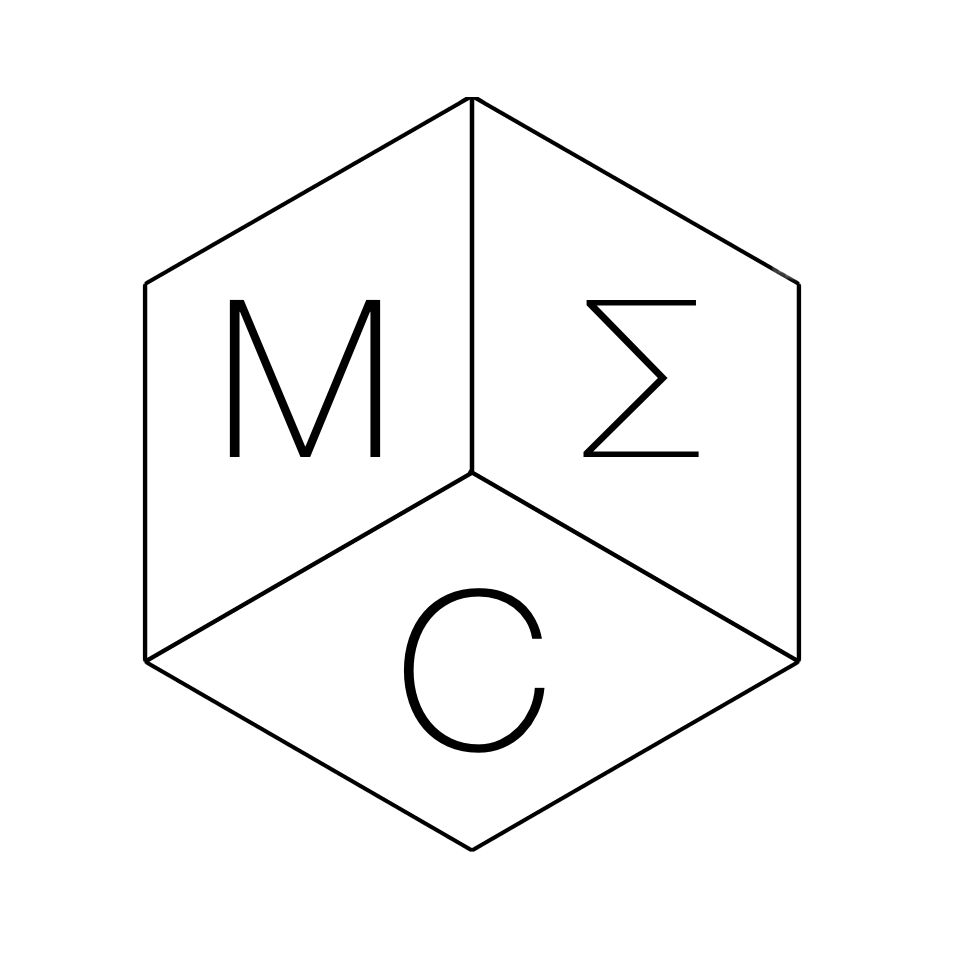

# Welcome to Project MEC

The MEC Project was born in 2016 in the United Kingdom.

It all started from a discussion on Programming and the Pros and Cons of Arduino and Raspberry Pi.

Now a Smart Self-Made Drone is on its way, with a challenging Plan to deliver a first Functional Protype in a few months :)

